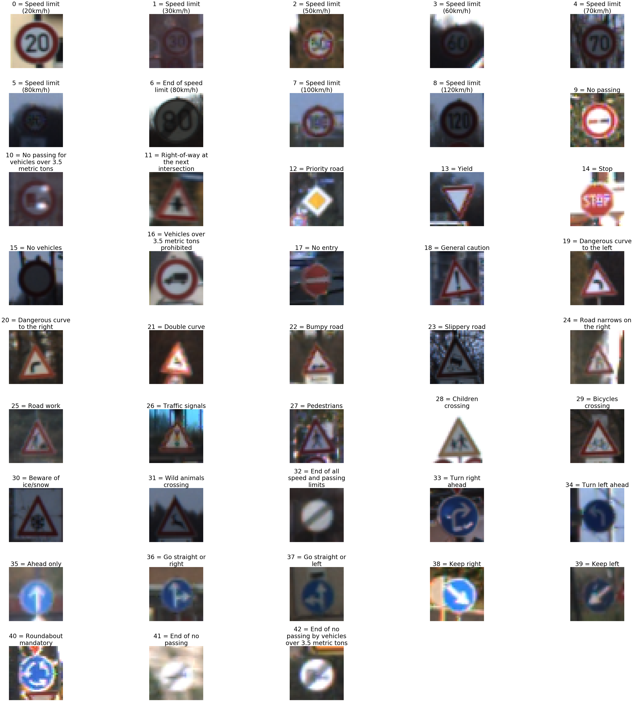
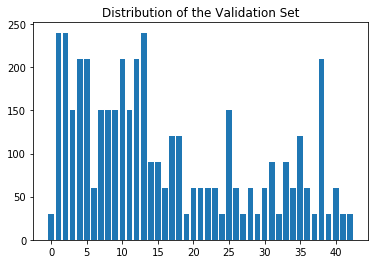
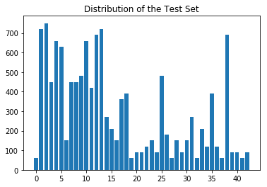
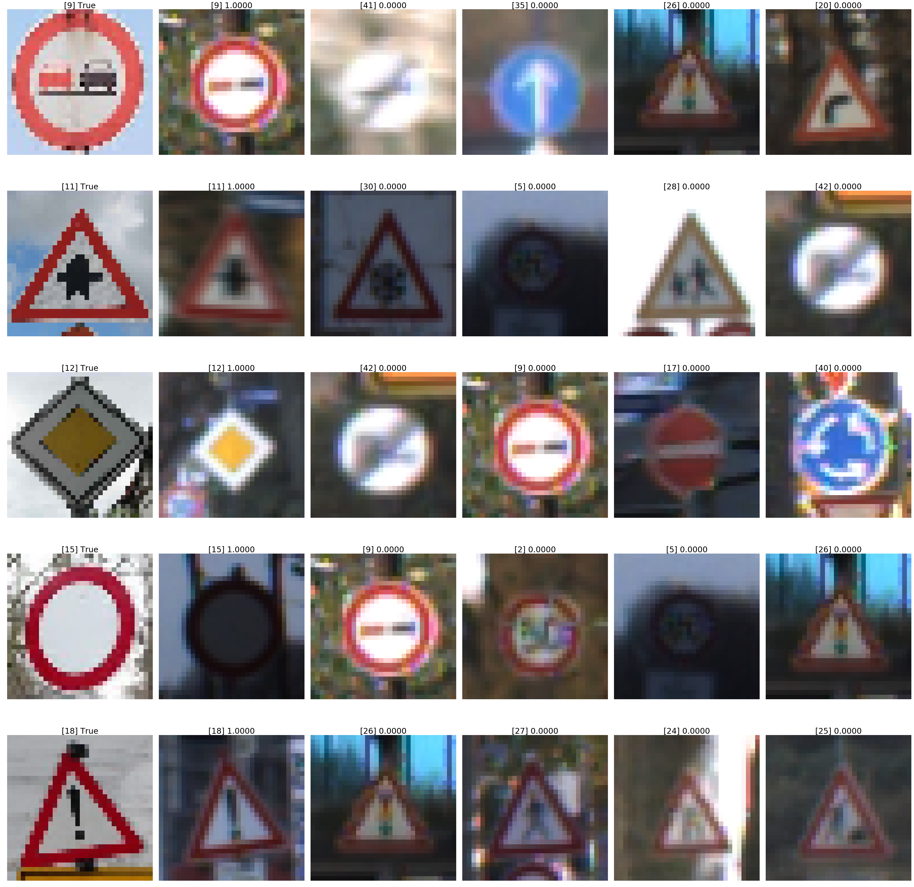

# **Traffic Sign Classifier** 

[Exported Jupyter notebook](https://jefflirion.github.io/udacity_car_nanodegree_project02/Traffic_Sign_Classifier.html)


## Data Set Summary & Exploration

### 1. Provide a basic summary of the data set. 

* The size of the training set is 34,799
* The size of the validation set is 4,410
* The size of test set is 12,630
* The shape of a traffic sign image is 32 x 32
* The number of unique classes/labels in the data set is 43


### 2. Include an exploratory visualization of the dataset.

Here is an exploratory visualization of the data set. 

This figure shows an example for each of the 43 sign types.  



These bar charts illustrate the distributions of the training, validation, and test sets, respectively.  At a glance, these three sets seem to be distributed similarly across the 43 sign types.  







## Design and Test a Model Architecture

### 1. Describe how you preprocessed the image data. What techniques were chosen and why did you choose these techniques?

My pre-processing was simple: for each of the 3 color channels (RGB), I modified the values as `(pixel - 128.) / 128.`.  This ensures that the pixel values are in [-1, 1].  Normalizing the data is important because it helps to avoid a poorly conditioned optimization problem.  Moreover, by normalizing in this manner we retain all of the information about the images, since we could always convert back to the original images via `normalized_pixel * 128. + 128.`.  As such, there is no reason to display an image of a pre-processed image -- it is simply a shifted and rescaled version
of the original.  

I tried using the mean µ and the standard deviation σ to rescale the images so that they had mean zero and standard deviation one, but this did not work as well as the simpler rescaling approach.  I suspect that this is because color is an important feature in this classification problem, and so standardizing the images to all have the same average pixel intensity results in a loss of valuable information.  


### 2. Describe what your final model architecture looks like including model type, layers, layer sizes, connectivity, etc.) Consider including a diagram and/or table describing the final model.

My model is based off LeNet.  The final model consisted of the following layers:

| Layer           | Description                                       | 
|:----------------|:--------------------------------------------------| 
| Input           | 32x32x3 RGB image                                 |
| Convolution 5x5 | 1x1 stride, `VALID` padding, outputs 28x28x6      |
| ReLU            |                                                   |
| Max pooling     | k=2, 2x2 stride, `SAME` padding, outputs 14x14x16 |
| ReLU            |                                                   |
| Convolution 5x5 | 1x1 stride, `VALID` padding, outputs 10x10x16     |
| ReLU            |                                                   |
| Max pooling     | k=2, 2x2 stride, `SAME` padding, outputs 5x5x16   |
| Flatten   	  | outputs 400                                       |
| Fully connected | outputs 120                                       |
| ReLU            |                                                   |
| Fully connected | outputs 84                                        |
| ReLU            |                                                   |
| Fully connected | outputs 43                                        |
 
 For training, I used dropout on each of these layers.  


#### 3. Describe how you trained your model. The discussion can include the type of optimizer, the batch size, number of epochs and any hyperparameters such as learning rate.

I used 50 epochs for training the model.  Initially I used 10, but I found that more epochs were needed in order to achieve a higher accuracy.  I also tried 100 epochs but found that it did not provide any improvement over 50 epochs.  

I used the same optimizer, `tf.train.AdamOptimizer`, as in the LeNet lab.  

I used `rate = 0.001` for the learning rate; I tried using `rate = 0.0001` but the results were not as good.  

For dropout, I used `keep_prob = 0.9` when training, which I found delivered better results than using `keep_prob = 0.5` or not using dropout at all.  


### 4. Describe the approach taken for finding a solution and getting the validation set accuracy to be at least 0.93. Include in the discussion the results on the training, validation and test sets and where in the code these were calculated. Your approach may have been an iterative process, in which case, outline the steps you took to get to the final solution and why you chose those steps. Perhaps your solution involved an already well known implementation or architecture. In this case, discuss why you think the architecture is suitable for the current problem.

My final model results were:

* training set accuracy of 100.0%
* validation set accuracy of 95.6%
* test set accuracy of 94.8%


My model is based off the LeNet model.  The main differences are:

* the input has a depth of 3 (RGB images), not 1 (grayscale images)
* the inclusion of dropout
* the output layer has a length of 43 (the number of sign types), not 10 (the number of digits)


As LeNet was designed for image classification (specifically, handwritten digits), I felt it was a good choice to use as a base for this traffic sign classification model.  However, while the input for LeNet are grayscale images, I opted to use (normalized) color images as my input because the color of the signs should provide useful information for classifying them.  

I used convolutional layers because they are translation invariant and can detect features regardless of where they are in the image.  I used max pooling to transform the layers from wide and shallow to narrow and deep.  And I used dropout to combat overtraining and to force the model to develop redundant ways to detect features.  


## Test a Model on New Images

### 1. Choose five German traffic signs found on the web and provide them in the report. For each image, discuss what quality or qualities might be difficult to classify.

Here are five German traffic signs that I found on the web:


I cropped these to be square and also so that the sign is centered in the image.  

To be honest, all of these images are pretty easy to classify and it's not surprising that the model achieved 100% accuracy on them.  This is simply because a Google image search for "German traffic signs" yields pretty clear and high quality images of German traffic signs.  In fact, these images seem to be more clear than the training set images, as seen above.  


### 2. Discuss the model's predictions on these new traffic signs and compare the results to predicting on the test set. At a minimum, discuss what the predictions were, the accuracy on these new predictions, and compare the accuracy to the accuracy on the test set.

Here are the results of the prediction:

| Image                                      | Prediction                                 |
|:-------------------------------------------|:-------------------------------------------| 
| (9) No passing                             | (9) No passing                             | 
| (11) Right-of-way at the next intersection | (11) Right-of-way at the next intersection | 
| (12) Priority road                         | (12) Priority road                         |
| (15) No vehicles                           | (15) No vehicles                           |
| (18) General caution                       | (18) General caution                       |


The model was able to correctly classify all 5 of the traffic signs.  


### 3. Describe how certain the model is when predicting on each of the five new images by looking at the softmax probabilities for each prediction. Provide the top 5 softmax probabilities for each image along with the sign type of each probability. 

As copy & pasted from the output of cell 24 in my Jupyter notebook, the softmax probabilities:

```
[[  1.00000e+00   5.13824e-08   4.68345e-09   9.60071e-12   5.32794e-12]
 [  1.00000e+00   4.96308e-08   1.35513e-15   6.64222e-17   2.89836e-18]
 [  1.00000e+00   5.01552e-13   1.34005e-15   5.75203e-16   4.50225e-16]
 [  1.00000e+00   4.86539e-14   3.33460e-14   1.75175e-14   6.74197e-15]
 [  1.00000e+00   1.40208e-10   9.01703e-12   3.54147e-13   2.16338e-14]]
```
 


The model is over 99.9999% certain for each of the 5 new images.  The image above shows each of the new images (first column) along with the top 5 images according to their softmax probabilities.  What I find most surprising is how certain the model is that the last new image (18 = "general caution") is not a "traffic signals" (26) sign, since these appear to be pretty similar to my human eye.  
